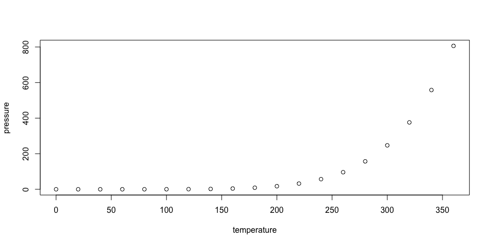
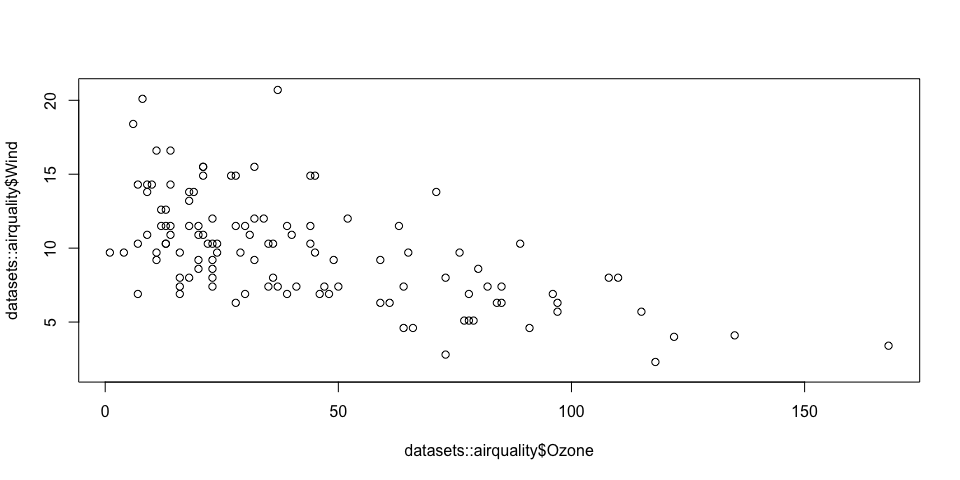

# Executive Summary

Today’s date is December 3, 2021.

## Overview & Research Question

The research question presented was if two federal tax programs motivated positive growth to revitalize neighborhoods between the years of 2000-2010.  The two programs analyzed were: Low Income Housing Tax Credits (LIHTC) and New Market Tax Credits (NMTC).

This paper leverages census data to determine the neighborhood change in three cities - using median home value as the dependent variable.  Researchers then combined three census variables (vacancy rates, change in unemployment rates, and change in household income) to develop an indicator of increased gentrification within the same neighborhoods.  The purpose of the gentrification variables is to contextualize rises in median home value to avoid the pitfalls of hedonic housing models.  Leveraging these two indicators, researchers conducted an analysis of three cities to determine if positive growth occurred as a result of these tax progra

## Program Details

### Low-Income Housing Tax Credit (LIHTC)

“The Low-Income Housing Tax Credit (LIHTC) subsidizes the acquisition, construction, and rehabilitation of affordable rental housing for low- and moderate-income tenants. The LIHTC was enacted as part of the 1986 Tax Reform Act and has been modified numerous times. Since the mid-1990s, the LIHTC program has supported the construction or rehabilitation of about 110,000 affordable rental units each year (though there was a steep drop-off after the Great Recession of 2008–09)—over 2 million units in all since its inception.”

The way that the LIHTC works is that the federal government issues tax credits to state and territorial governments. State housing agencies then award the credits to private developers of affordable rental housing projects through a competitive process. Developers generally sell the credits to private investors to obtain funding.  

### New Market Tax Credits (NMTC)

“On the last day of its 2000 session, Congress created the New Markets Tax Credit program, part of the Community Renewal Tax Relief Act of 2000, to encourage investment in low-income communities. The program is designed to generate $15 billion in new private sector investments in low-income communities.”

The NMTC works by attracting private investors into the low-income housing market by allowing individual corporate investors to receive a tax credit (against their federal taxes) in exchange for making equity investments in Community Development Entities (“CDEs”).  These CDEs then rejuvenate low-income communities by spending the invested capital to renovate the communities.   

The goal of both of these programs was to help distressed communities by providing billions of dollars in funding to improve housing, infrastructure, and neighborhoods.  In addition to the median home value dependant variable, the researchers have chosen to measure gentrification as a means to determine neighborhood change.  The term gentrification means, “the process of renewal and rebuilding accompanied by the influx of middle-class or affluent people into deteriorating areas that often displaces poor residents.”  The purpose of using gentrification as a measurement, despite the potentially controversiality, is to find other variables that might indicate that the tax programs are having their intended effect - so that we do not myopically focus on median home value to the exclusion of other variables.

## Data

### Raw Census Data

The American Community Survey (ACS) and the Current Population Survey (CPS) are ongoing sample surveys of the population that collect detailed demographic and socioeconomic characteristics. Sample surveys collect information from just a small subset of the population, either randomly or from targeted groups, which is used to estimate what the total population is. The size of the sample is carefully determined, so that the sample data can be used to estimate the total population for a given geographic area with a reasonable level of precision. The ACS is a large survey that is published annually for large and small geographic areas, while the CPS is a smaller survey that is published monthly and is summarized for the nation as a whole or for the states.

### LTDB Codebook

The Longitudinal Tract Database (LTDB) allows one to normalize census tract data from previous years (1970-2000) to 2010 census tract boundaries. The LTDB includes both a selection of short-(Full Count) and long-form (Sample Count) items from 1970-2000, as well as a utility which allows you to input any census-tract based item and normalize the boundaries to 2010 boundaries.  For each Census year (1970-2010), normalized Full Count and Sample Count data from S4 at Brown University were joined to the 2010 tract boundary file.  New File Geodatabase Feature Classes were created for each join, resulting in a series of normalized datasets.

## Methods

Using the LTDB Codebook as a way to normalize the data, researchers processed the median home value.  Median divides the value distribution into two equal parts: one-half of the cases falling below the median value of the property (house and lot) and one-half above the median. Median value calculations are rounded to the nearest hundred dollars. Home for the purposes of this analysis was owner-occupied if the owner or co-owner lives in the unit, even if it is mortgaged or not fully paid for. The owner or co-owner must live in the unit and usually is Person 1 on the questionnaire. The unit is “Owned by you or someone in this household with a mortgage or loan” if it is being purchased with a mortgage or some other debt arrangement such as a deed of trust, trust deed, contract to purchase, land contract, or purchase agreement. Value was calculated as the fair market value of the property as sold on a neutral basis during the time the census data was collected.  

Due to the nature and scope of census data, variables presented included data that had misleading outliers.  This required researchers to process the data to remove those outliers.  To do that, researchers had to isolate the pain-points in the data that were misleading (and skewing variables like median value).  

## Results

The first surprising finding of this study was that the median home value in many communities was lower in the tracts that had received both the LIHTC and the NMTC.  


``` r
summary(cars)
```

    ##      speed           dist       
    ##  Min.   : 4.0   Min.   :  2.00  
    ##  1st Qu.:12.0   1st Qu.: 26.00  
    ##  Median :15.0   Median : 36.00  
    ##  Mean   :15.4   Mean   : 42.98  
    ##  3rd Qu.:19.0   3rd Qu.: 56.00  
    ##  Max.   :25.0   Max.   :120.00

## Including Plots

You can also embed plots, for example:

<!-- -->

<!-- -->

Note that the `echo = FALSE` parameter was added to the code chunk to
prevent printing of the R code that generated the plot.

## Including regression output

``` r
# load necessary packages ----
library(stargazer)

# load constants ----
STARGAZER_OUTPUT_TYPE = "html"

# create model ----
first_lm <- lm(Ozone ~ Wind, data = datasets::airquality)

# display model
stargazer::stargazer(
  first_lm,
  type = STARGAZER_OUTPUT_TYPE,
  title = "Table 1. Linear regression using airquality dataset to predict Ozone values using Wind values."
)
```

<table style="text-align:center">

<caption>

<strong>Table 1. Linear regression using airquality dataset to predict
Ozone values using Wind values.</strong>

</caption>

<tr>

<td colspan="2" style="border-bottom: 1px solid black">

</td>

</tr>

<tr>

<td style="text-align:left">

</td>

<td>

<em>Dependent variable:</em>

</td>

</tr>

<tr>

<td>

</td>

<td colspan="1" style="border-bottom: 1px solid black">

</td>

</tr>

<tr>

<td style="text-align:left">

</td>

<td>

Ozone

</td>

</tr>

<tr>

<td colspan="2" style="border-bottom: 1px solid black">

</td>

</tr>

<tr>

<td style="text-align:left">

Wind

</td>

<td>

\-5.551<sup>\*\*\*</sup>

</td>

</tr>

<tr>

<td style="text-align:left">

</td>

<td>

(0.690)

</td>

</tr>

<tr>

<td style="text-align:left">

</td>

<td>

</td>

</tr>

<tr>

<td style="text-align:left">

Constant

</td>

<td>

96.873<sup>\*\*\*</sup>

</td>

</tr>

<tr>

<td style="text-align:left">

</td>

<td>

(7.239)

</td>

</tr>

<tr>

<td style="text-align:left">

</td>

<td>

</td>

</tr>

<tr>

<td colspan="2" style="border-bottom: 1px solid black">

</td>

</tr>

<tr>

<td style="text-align:left">

Observations

</td>

<td>

116

</td>

</tr>

<tr>

<td style="text-align:left">

R<sup>2</sup>

</td>

<td>

0.362

</td>

</tr>

<tr>

<td style="text-align:left">

Adjusted R<sup>2</sup>

</td>

<td>

0.356

</td>

</tr>

<tr>

<td style="text-align:left">

Residual Std. Error

</td>

<td>

26.467 (df = 114)

</td>

</tr>

<tr>

<td style="text-align:left">

F Statistic

</td>

<td>

64.644<sup>\*\*\*</sup> (df = 1; 114)

</td>

</tr>

<tr>

<td colspan="2" style="border-bottom: 1px solid black">

</td>

</tr>

<tr>

<td style="text-align:left">

<em>Note:</em>

</td>

<td style="text-align:right">

<sup>*</sup>p\<0.1; <sup>**</sup>p\<0.05; <sup>***</sup>p\<0.01

</td>

</tr>

</table>
